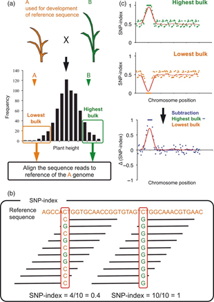

# BSR-seq原理
BSR-seq[[1](#ref)]是一种将Bulked‐segregant analysis (BSA)[[2](#ref),[3](#ref)]和RNA-seq相结合，快速定位QTL的方法。目标性状有差异的双亲构建的分离群体中分别选取极端表型个体进行等量混合构建两个极端表型bulked DNA pool并进行测序。随后进行变异分析筛选出双亲间SNP位点并分别计算两个bulked DNA pool中每个SNP位点上某一亲本基因型read覆盖深度占该位点总read深度的比值，即SNP index，通过两个bulked DNA pool的SNP index相减即得到ΔSNP index。在基因组所有区域中，目标基因及其连锁的区域由于根据表型受到相反的选择在两个bulked DNA pool中表现出不同的趋势，因此ΔSNP index会显著偏离0附近；另一方面，于目标形状无关的区域则两个bulked DNA pool则表现为相似的变化趋势，因此ΔSNP index会在0附近波动（图1）。

# BSR流程
## 取样、提取DNA、建库和测序
选取分离群体中极端表型个体各30-50株以及双亲取样，分别提取RNA构建bulked pools，然后进行建库和高通量测序。（具体流程应参考实验设计以及公司测序报告）
## 数据过滤
使用fastp[[4](#ref)]（version: 0.20.0）对raw data进行过滤得到clean data。统计过滤前后total bases、total reads、Q30、Q20、GC content以及有效数据比率（data_stat.csv/txt），同时使用FastQC（version: 0.11.9）对过滤前后的数据进行质量评估（QC/sample_fastqc.html）。
## 比对到参考基因组
使用STAR[[5](#ref)]（version: 2.7.3a）软件的2-pass模式将clean reads比对到ZS11参考基因组[[6](#ref)]上， 并使用Picard tools[[7](#ref)]（version: 2.23.2）去除建库过程中产生的PCR重复。
## 变异分析
变异分析使用Genome Analysis Toolkit，GATK[[8](#ref)]（version: 3.8-0-ge9d806836）完成，首先使用GATK的HaplotypeCaller功能对样本单独分析再使用CombineGVCFs功能合并，随后使用GenotypeGVCFs功能得到SNP和INDEL信息，最后使用VariantFiltration功能过滤原始的变异位点的到可靠的变异信息。
## QTL-seq分析
在变异分析得到的可靠SNP位点中，筛选亲本内纯和并且亲本间不同的位点，并且进一步过滤掉双亲和两各混池中低覆盖深度的位点，此时统计剩余SNP位点在基因组上的分布情况并绘图。利用最终筛选出的SNP进行下一步的分析，首先计算每个混池的SNP index值，随后计算ΔSNP index值并绘图，其中点图按照1 Mb窗口大小、100kb步长进行滑窗统计，折线图是由R软件（version: 4.0.2）扩展包QTLseqr[[9](#ref)]（version: 0.7.5.2）按照1 Mb窗口大小统计得到，置信区间按照Takagi 等（2013）[[1](#ref)]描述方法计算得到，超出95或99%置信区间的区域视为目标性状候选QTL。

# 结果
## 数据过滤

| sample | total_reads.raw | total_bases.raw | q20_bases.raw | q30_bases.raw | q20_rate.raw | q30_rate.raw | read1_mean_length.raw | read2_mean_length.raw | gc_content.raw | total_reads.clean | total_bases.clean | q20_bases.clean | q30_bases.clean | q20_rate.clean | q30_rate.clean | read1_mean_length.clean | read2_mean_length.clean | gc_content.clean | effective.rate |
| ------ | --------------- | --------------- | ------------- | ------------- | ------------ | ------------ | --------------------- | --------------------- | -------------- | ----------------- | ----------------- | --------------- | --------------- | -------------- | -------------- | ----------------------- | ----------------------- | ---------------- | -------------- |
| F2G    | 75736438        | 11360465700     | 10971417888   | 10323095953   | 0.965754     | 0.908686     | 150                   | 150                   | 0.482547       | 75353322          | 11296888304       | 10925612293     | 10285775631     | 0.967135       | 0.910496       | 149                     | 149                     | 0.48282          | 0.994403628    |
| F2P    | 74964258        | 11244638700     | 10837345471   | 10168897505   | 0.963779     | 0.904333     | 150                   | 150                   | 0.482165       | 74574544          | 11180234662       | 10790807296     | 10131010424     | 0.965168       | 0.906154       | 149                     | 149                     | 0.482399         | 0.994272467    |
| PG     | 75976178        | 11396426700     | 10982310950   | 10309383901   | 0.963663     | 0.904615     | 150                   | 150                   | 0.482663       | 75562076          | 11327978100       | 10933119926     | 10269449665     | 0.965143       | 0.906556       | 149                     | 149                     | 0.482908         | 0.993993854    |
| PP     | 67909346        | 10186401900     | 9820993918    | 9221559359    | 0.964128     | 0.905281     | 150                   | 150                   | 0.48069        | 67532438          | 10124080079       | 9776029146      | 9184920762      | 0.965621       | 0.907235       | 149                     | 149                     | 0.480973         | 0.993881861    |

## 比对统计

| sample | total reads | mapped reads | mapping rate | properly paired | properly paired rate |
| ------ | ----------- | ------------ | ------------ | --------------- | -------------------- |
| PP     | 71277732    | 71277732     | 1            | 63942328        | 0.897087017          |
| PG     | 79473933    | 79473933     | 1            | 72923312        | 0.917575226          |
| F2P    | 79022624    | 79022624     | 1            | 71516484        | 0.905012772          |
| F2G    | 79680796    | 79680796     | 1            | 72253224        | 0.906783411          |

## 变异分析
得到473,153个高质量SNP，59,107个Indel。
## 注释

## QTL-seq分析

# 参考文献
- [1]	Liu, S., Yeh, C. T., Tang, H. M., Nettleton, D., & Schnable, P. S. (2012). Gene mapping via bulked segregant RNA-Seq (BSR-Seq). PloS one, 7(5), e36406. https://doi.org/10.1371/journal.pone.0036406
- [2]	Giovannoni, J. J., Wing, R. A., Ganal, M. W., & Tanksley, S. D. (1991). Isolation of molecular markers from specific chromosomal intervals using DNA pools from existing mapping populations. Nucleic acids research, 19(23), 6553–6558. https://doi.org/10.1093/nar/19.23.6553
- [3]	Michelmore, R. W., Paran, I., & Kesseli, R. V. (1991). Identification of markers linked to disease-resistance genes by bulked segregant analysis: a rapid method to detect markers in specific genomic regions by using segregating populations. Proceedings of the National Academy of Sciences of the United States of America, 88(21), 9828–9832. https://doi.org/10.1073/pnas.88.21.9828
- [4]	Chen, S., Zhou, Y., Chen, Y., & Gu, J. (2018). fastp: an ultra-fast all-in-one FASTQ preprocessor. Bioinformatics (Oxford, England), 34(17), i884–i890. https://doi.org/10.1093/bioinformatics/bty560
- [5]	Dobin, A., Davis, C. A., Schlesinger, F., Drenkow, J., Zaleski, C., Jha, S., Batut, P., Chaisson, M., & Gingeras, T. R. (2013). STAR: ultrafast universal RNA-seq aligner. Bioinformatics (Oxford, England), 29(1), 15–21. https://doi.org/10.1093/bioinformatics/bts635
- [6]	Song, J. M., Guan, Z., Hu, J., Guo, C., Yang, Z., Wang, S., Liu, D., Wang, B., Lu, S., Zhou, R., Xie, W. Z., Cheng, Y., Zhang, Y., Liu, K., Yang, Q. Y., Chen, L. L., & Guo, L. (2020). Eight high-quality genomes reveal pan-genome architecture and ecotype differentiation of Brassica napus. Nature plants, 6(1), 34–45. https://doi.org/10.1038/s41477-019-0577-7
- [7]	“Picard Toolkit.” 2019. Broad Institute, GitHub Repository. http://broadinstitute.github.io/picard/; Broad Institute
- [8]	McKenna, A., Hanna, M., Banks, E., Sivachenko, A., Cibulskis, K., Kernytsky, A., Garimella, K., Altshuler, D., Gabriel, S., Daly, M., & DePristo, M. A. (2010). The Genome Analysis Toolkit: a MapReduce framework for analyzing next-generation DNA sequencing data. Genome research, 20(9), 1297–1303. https://doi.org/10.1101/gr.107524.110
- [9]	Mansfeld, B. N., & Grumet, R. (2018). QTLseqr: An R Package for Bulk Segregant Analysis with Next-Generation Sequencing. The plant genome, 11(2), 10.3835/plantgenome2018.01.0006. https://doi.org/10.3835/plantgenome2018.01.0006